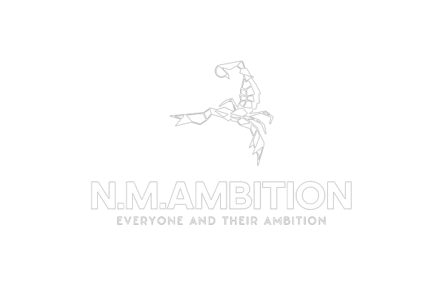

<h1 align="center">Hi 👋, I'm Neriya Malachi</h1>
<h3 align="center">Full Stack Developer & Instructor | Founder of NM Ambition</h3>

  

  

---

### 🚀 About Me

- 🔭 I’m currently working on: **Story Picture Project**
- 🧠 I specialize in: `React`, `Next.js`, `Node.js`, `MongoDB`, `TypeScript`
- 🌐 My portfolio: [nm-ambition.com/work](https://nm-ambition.com/work)
- 🏢 Company site: [nm-ambition.com](https://nm-ambition.com/)
- 📫 Reach me at: **neriamalachi@gmail.com**

---

### 🤝 Connect with Me

  

---

### 🛠️ Languages & Tools

  

    
  
  
    
                        

